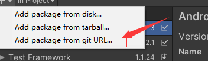
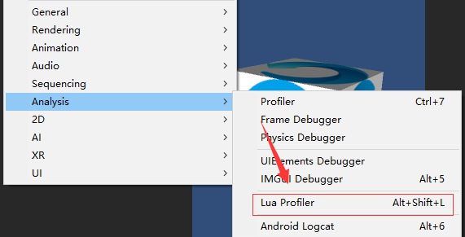
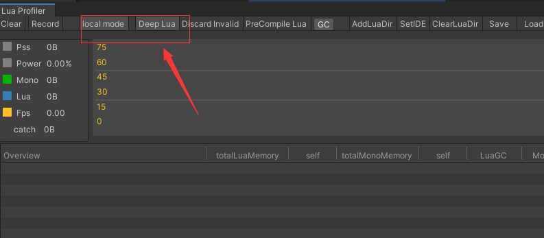
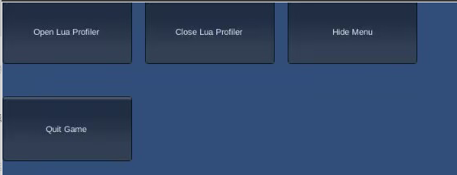
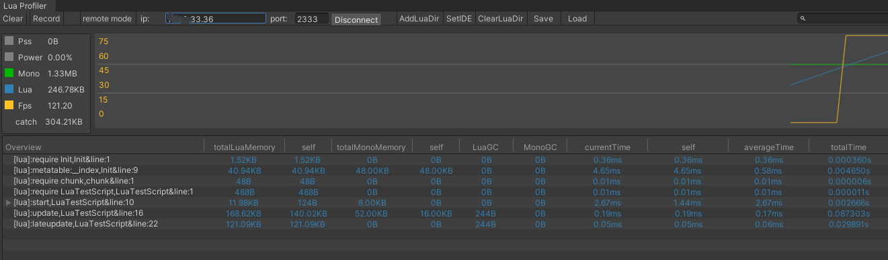
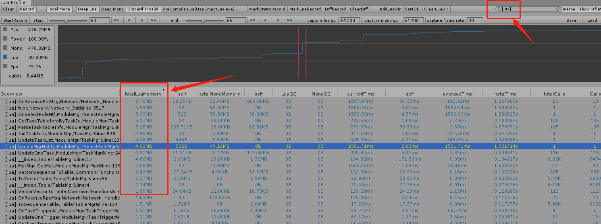

## Lua Profiler For Unity

### 支持情况
| 系统                  | 支持情况|
| ----------------------- | ------------ |
| `windows`| ✔  |
| `android`| ✔  |
| `MAC`| 支持中  |
| `IOS`| 支持中  |


### 部署和安装
1. 推荐安装Unity2019可以直接用PackageManager 用add by git路径添加,国内网络不好可以使用gitee代理

>https://github.com/leinlin/Miku-LuaProfiler.git

2. Unity5.6以上版本建议把代码clone下来，然后把LuaProfiler目录copy到Assets中

3. 看到这个菜单说明安装成功了


### 如何使用
- 编辑器使用推荐使用local模式，打开DeepLua开关即可


- 真机目前只支持android系统，打包的时候加上宏 `USE_LUA_PROFILER`
- 打包后，使用四根手指同时连续敲击屏幕5下以上后，就会出现以下菜单


- 点击 `Open Lua Profiler`就会打上标记，下一次启动游戏就会出现一个黑屏

编辑器中点击local mode 按钮就可以切换remote mode,输入手机ip就可以查看数据了


如果公司网络不允许你直接访问手机ip，那么可以用USB数据线连接手机和电脑输入以下指令
```
adb forward tcp:2333 tcp:2333
```
之后直接在ip栏中输入`127.0.0.1`即可

### 数据说明
| Name                    | Descriptions                                                                                              |
| ----------------------- | -------------------------------------------------------------------------------------------------------   |
| `Overview`              | 函数名称                                                                                                  |
| `totalLuaMemory`        | 此函数生成的所有Lua GC的总和                                                                              |
| `self`                  | 函数本身产生的GC量                                                                                        |
| `totalMonoMemory`       | 此函数生成的所有Mono GC的总和                                                                             |
| `self`                  | 函数本身产生的GC量                                                                                        |
| `currentTime`           | 函数在当前帧中运行所需的时间                                                                              |
| `averageTime`           | 计算在函数上花费的时间的平均值                                                                            |
| `totalTime`             | 此功能消耗的所有时间                                                                                      |
| `LuaGC`                 | 由当前帧生成的Lua GC                                                                                      |
| `MonoGC`                | 由当前帧生成的Mono GC                                                                                     |
| `totalCalls`            | 游戏开始后此功能的运行次数                                                                                |
| `Calls`                 | 函数当前帧的执行次数                                                                                      |

### FAQ

有的Unity版本不支持 `[RuntimeInitializeOnLoadMethod(RuntimeInitializeLoadType.BeforeSceneLoad)]`这个属性的时候，你可以在lua虚拟机启动之前调用代码
```
MikuLuaProfiler.HookLuaSetup.OnStartGame();
```

真机数据只有resume或者协程数据
> 不要用luac加密代码，请直接使用明码字符串


运行了性能调试之后，用代码调用luaGC无效
> 为了防止lua的GC导致内存统计出现负数，本项目直接用hook技术接管了lua的GC函数，让用户的自动促发无效，GC会根据内存是否增长到上次GC的1.2倍左右就触发，如果项目的Update GC优化的较好，内存曲线是基本一致的。


关于XLua demo跑不起来的问题
> 把Demo里面LuaBehaviour 中 internal static LuaEnv luaEnv = new LuaEnv()的赋值改到Awake里面

关于自定义profiler点
```
local LuaProfiler = require('MikuLuaProfiler').LuaProfiler
LuaProfiler.BeginSampleCustom("profiler name")
-- your code
LuaProfiler.EndSampleCustom()
```

运行起来后totalLuaMemory为负数
>底层统计lua内存申请采用记录lua虚拟机总量来记录对应的GC，如果函数运行的中间发生了GC就会导致内存差值为负数，你可以把自动GC关闭掉后进行统计。

如何对Lua函数进行各种数据排序
>在搜索框中输入：[lua],然后点击右上角的merge按钮,最后点击各个数据标签进行排序


如何定位Lua函数内存暴涨的点
>使用Record模式启动游戏，在想采样的地方点击StartRecord,截取完记录后，找一段明显内存上涨的地方，采样出来分析函数即可.（鼠标点击上去，然后按键盘的左右键）


ref的function代表什么
>这里存储的一般都是C#这里持有的回调函数，你可以每一次打开UI前先clear数据，然后进入UI后记录数据，释放UI后如果 还持有不少委托，就代表说泄漏了。

<span id="contact_zh"></span>
### [联系](#zh)
如果您发现任何错误或有任何建议加入QQ群：[882425563](https://jq.qq.com/?_wv=1027&k=5QkOBSc) 与我们联系

<span id="contact_zh"></span>
## 投食


##


