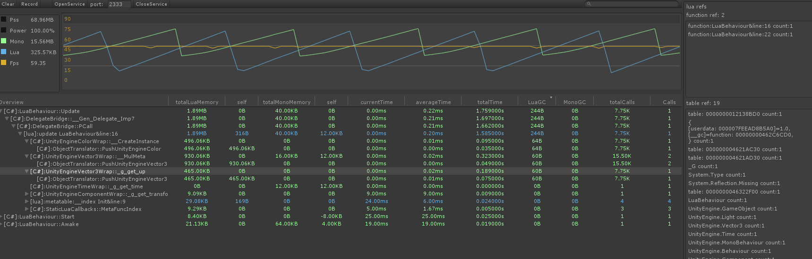

## Lua Profiler For Unity

### 支持情况
目前只支持Windows下，Unity5.6版本以上的编辑器进行使用，支持市场上所有版本的lua，包括各种魔改。


### 部署和安装
目前只支持Windows上编辑器进行使用，远程版还在开发中。直接将Exsample下的LuaProfiler文件夹拷贝到工程目录下。

### 使用说明
在Windows菜单下也有个LuaProfiler选项，点击后即可打开窗口。开启DeepLua,运行游戏就能看到对应的数据。

### FAQ
运行起来提示找不到EasyHook64.dll
```
从文件夹下找到EasyHook64.dll,Copy出来放到Unity编辑器exe同目录下即可。
```
运行起来后totalLuaMemory为负数
```
底层统计lua内存申请采用记录lua虚拟机总量来记录对应的GC，如果函数运行的中间发生了GC就会导致内存差值为负数，你可以把自动GC关闭掉后进行统计。
```
ref的function代表什么
```
这里存储的一般都是C#这里持有的回调函数，你可以每一次打开UI前先clear数据，然后进入UI后记录数据，释放UI后如果 还持有不少委托，就代表说泄漏了。
```
MarkStaticRecord、MarkLuaRecord、DiffRecord、ClearDiff有什么用
```
这一组功能是查泄漏使用的。举一个例子，你可以在打开UI前MarkStaticRecord，进行一次内存快照，然后打开UI后MarkLuaRecord，记录第二次快照，最后你在调用UI释放的函数这里DiffRecord。如果打开UI前不持有，而打开UI后与释放UI后都持有的对象为泄漏。
函数API为：
function miku_do_record(val, prefix, key, record, history, null_list, staticRecord)

function miku_diff(record, staticRecord)
```
DeepMoono、Discard Invalid、Precompile Lua选项有什么用
```
DeepMoono：如果你的代码大部分在Assembly-CSharp.dll里面的话，你可以开启DeepMono，这时候将把C#、Lua整个相互调用都显示出来。
Discard Invalid：因为记录的压力实在太大了，所以就把一些没有内存消耗，然后耗时较低的函数排除掉了。
Precompile Lua：有的人实在跑不起来我这套东西，你可以用Tools里面的LuaInject.exe处理一下你的lua代码，使用起来也简单，copy到你的lua文件夹下双击运行一下，对应的代码就插入好了
```
目前暂时放弃了真机调试，想真机调试的可以去master版本试试看，xlua的项目没有什么大问题

<span id="contact_zh"></span>
### [联系](#zh)
如果您发现任何错误或有任何建议加入QQ群：[882425563](https://jq.qq.com/?_wv=1027&k=5QkOBSc) 与我们联系
