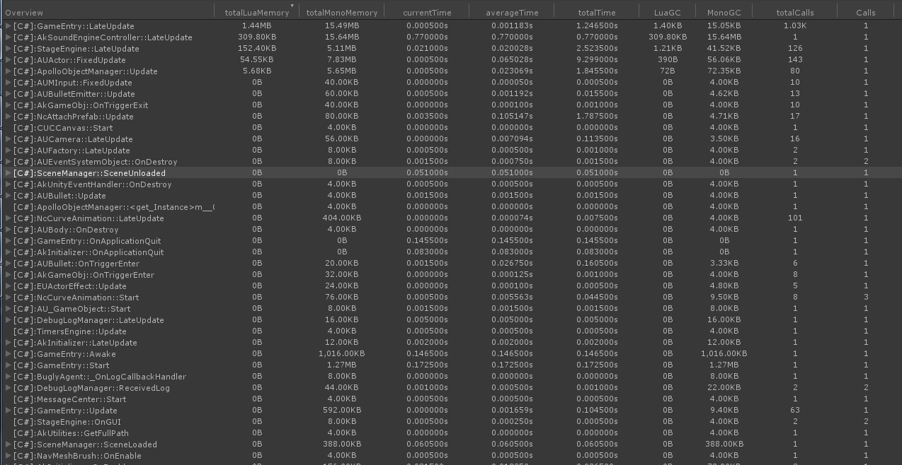

## Lua的性能分析器 For Unity
<br/>

### 部署安装
目前支持XLua、SLua、ToLua,Unity的版本在5.6（包括5.6）以上


- 首先把LuaProfiler文件夹Copy到Assets 非Plugin、Editor目录下。
- 打开"LuaProfiler/HookSetup/LuaHookSetup.cs"
- 在10~12行开启对应的Lua版本宏即可
- 或者到对应版本的Lua里面把LuaProfiler文件夹导入到你的工程目录中

``` 
//#define XLUA
//#define TOLUA
//#define SLUA
``` 


----------


### 使用教程

#### 开启

点击 "Window->Lua Profiler Window"在弹出窗口上打开 Deep Profiler,正常进入游戏即可看到profiler数据

效果如下

<br/>

---
#### Record模式
&nbsp;&nbsp;&nbsp;&nbsp;也是默认模式，如果关闭点击Profiler窗口下的Record按钮即可开启。在这个模式下将保存每次Profiler采样的历史记录，并且会将出现帧率下降、或者超大GC申请的Sample进行截屏保存,需要截屏的GC的阈值你可以在 __capture gc__ 后面的输入框中进行配置。
&nbsp;&nbsp;&nbsp;&nbsp;当你在编辑器下暂停或者关闭游戏的时候你可以拖动 __start__ 以及__end__的进度条进行历史记录查阅,sample列表中将显示__start__到 __end__ 的累计采样值。要单独观察某一个sample的消耗可以把__start__和 __end__ 设置为相同值。

##### 按钮功能介绍


- 拉动滑条可以快速大概的调整sample帧
- 点击 __'<'__ 、 __'>'__ 两个按钮一次只增加或减少1帧
- 点击 __'<<'__ 、 __'>>'__ 两个按钮可以快速移动到效率出了问题的某些帧
- 点击 __'start2end'__ 、 __'end2start'__ 两个按钮可以把start与end的sample帧设置为相同的值配合'>>'、'<<'可以帮助你快速了解到这些效率帧都发生了什么。
- Save跟Load 两个按钮可以保存和载入Sample的采样信息，截屏信息保存在Assets同级目录的capture目录下，看情况删除吧。

使用效果

<br/>

---
#### 正常模式
&nbsp;&nbsp;&nbsp;&nbsp;正常模式一般是针对本身就很卡的游戏，如果不想被Record模式的截屏影响
效率。你就可以选择这种模式，直接点击Record按钮关闭Record就可以了，几乎不会对游戏本身造成什么效率问题，你可以先在这个模式下把一些GC或者时间占用超长的明显函数进行优化后，在使用Record模式去细化发现一些隐藏比较深的效率问题。比如点击某些按钮、开启模型UI、摇杆、某些服务器协议的开启等等.....
<br/>
 __特别提醒，因为截屏的效率不是很高，如果游戏本身效率不是很好，很容易触发截屏的话，建议把编辑器的分辨率设置为480*270，这样不会因为分辨率过大而导致截屏保存的IO卡顿__ 


---
有什么BUG可以联系加群：882425563

---
### 感谢

#### 第三方库
[Misaka Mikoto 的MonoHooker](https://github.com/easy66/MonoHooker) <br/>
[xebecnan 的 UniLua](https://github.com/xebecnan/UniLua) <br/>

#### 关键问题解决者
[Xavier](https://github.com/starwing)

#### 关键测试的成员
[Jay](https://github.com/Jayatubi) <br/>
[ZhangDi](https://github.com/ZhangDi2018) <br/>
以及[LuaProfiler](https://jq.qq.com/?_wv=1027&k=5QkOBSc)群中的所有群成员

### 已知使用项目

---


---


---
